AI shell script solutions injected right into your prompt.

`aish` is a single file shell script for getting one-liner solutions from AI right into your terminal where you need them.

## Install

...

Make sure you sent the environment variable [`OPENAI_API_KEY`](https://platform.openai.com/account/api-keys).

## Help

...

## Examples

Prefix these queries with `aish` in your terminal to try them out:

- which process is running on port 8000
- numeric for loop boilerplate going from 5 to 15
- restart openssh
- start a simple webserver using python3
- rename every file in ~/images from .jpg to .png
- print out the source of function __git_ps1
- delete all unused docker images
- concatenate two .mkv video files
- use ffmpeg to shrink an mp4 file's size
- use imagemagick change the white background in screenshot.png to transparent
